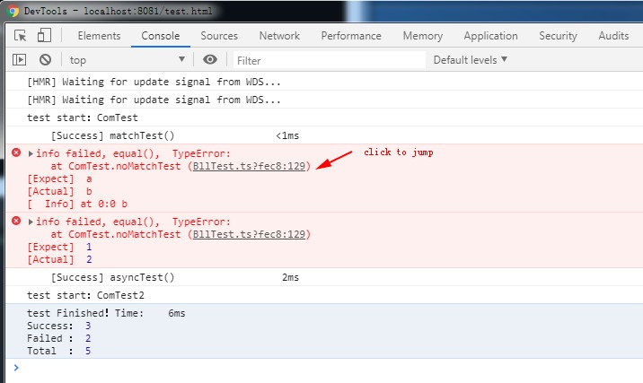

# tsunit

一个仿照c#接口写的typescript单元测试框架

[https://github.com/xxxxst/tsunit](https://github.com/xxxxst/tsunit)

[English](https://github.com/xxxxst/tsunit)
[简体中文](https://github.com/xxxxst/tsunit/blob/master/doc/README-CN.md)

# 特性
- 简洁的接口
- 运行于chrome
- 方便定位错误位置
- 支持异步测试用例

<h2 align="center">安装</h2>

```bash
npm install @xxxxst/tsunit
```

<h2 align="center">配置</h2>

- 启用 decortor
- 启用 source map

查看更多配置

[https://github.com/xxxxst/example-tsunit](https://github.com/xxxxst/example-tsunit)

<h2 align="center">使用</h2>

测试文件 - ComTest.ts
```ts
@TestClass()
export default class ComTest {
    @Test()
    matchTest() {
        Assert.equal(1, 1);
        Assert.notEqual("aa", "bb");
    }

    @Ignore()
    @Test()
    ignoreTest() {
        Assert.equal(1, 2, "info");
    }

    @Test(1, 2)
    @Test("a", "b")
    noMatchTest(except, actual) {
        Assert.equal(except, actual, "info");
    }

    @AsyncTest()
    async asyncTest() {
        var rst = await this.getHttp();
        Assert.equal("data", rst);
    }

    async getHttp() {
        return new Promise(resolve => setTimeout(()=>{
            resolve("data");
        }, 0));
    }
}
```

测试文件 - ComTest2.ts
```ts
@TestClass({autoRun:false})
export default class ComTest2 {
    constructor(arg1, arg2) {

    }
}
```

程序入口文件
```ts
// 不需要创建测试类，导入即可自动执行
import './ComTest';

// 第二种引用方式
// 确保类被引用过
import ComTest from './ComTest';
ComTest

// 自定义执行测试程序
import ComTest2 from './ComTest2';
// ... 你的初始化代码
setTimeout(()=>{
    // 运行测试
    Assert.run(ComTest2, "arg1", "arg2");
}, 0);
```

打开控制台查看测试信息



<h2 align="center">接口</h2>

## 装饰器

@TestClass(option?:{autoRun?:boolean}, ...args)

- 类装饰器
- 标记测试类
- `autoRun` 自动执行测试, 默认为`true`
- `args` 测试类构造函数参数

@Test(...args)

- 方法装饰器
- 标记测试方法
- `args` 方法参数

@AsyncTest(...args)

- 方法装饰器
- 标记异步测试方法
- 需要使用`async/await`
- `args` 方法参数

@Ignore()

- 方法装饰器
- 忽略(异步)测试方法

## Assert

Assert.run(class, ...args)

- 自定义运行测试类
- 需要在 @TestClass()使用`autoRun:false`
- `class` 测试类
- ` args` 测试类构造函数参数

Assert.setLang(obj)

- 设置语言，默认为英语
- `obj` 语言数据, 详细数据请查看源代码
  + 内置语言:
  + `Assert.lang_en_us` 英语
  + `Assert.lang_zh_cn` 简体中文

Assert.equal(expected:any, actual:any, desc: string = "")

- 测试是否相等，如果是`object`类型则遍历进行比较
- `expected` 期望值
- `actual` 实际值
- `desc` 描述信息

其他assert

-|-
:-|:-
Assert.equal          | (expected:any, actual:any, desc: string = "")
Assert.notEqual       | (expected:any, actual:any, desc: string = "")
Assert.strongEqual    | (expected:any, actual:any, desc: string = "")
Assert.strongNotEqual | (expected:any, actual:any, desc: string = "")
Assert.same           | (expected:any, actual:any, desc: string = "")
Assert.notSame        | (expected:any, actual:any, desc: string = "")
Assert.isTrue         | (actual:any, desc: string = "")
Assert.isFalse        | (actual:any, desc: string = "")
Assert.isEmpty        | (actual:any, desc: string = "")
Assert.isNotEmpty     | (actual:any, desc: string = "")
Assert.isNull         | (actual:any, desc: string = "")
Assert.isNotNull      | (actual:any, desc: string = "")
Assert.isUndefined    | (actual:any, desc: string = "")
Assert.isNotUndefined | (actual:any, desc: string = "")
Assert.isBool         | (actual:any, desc: string = "")
Assert.isArray        | (actual:any, desc: string = "")
Assert.isObject       | (actual:any, desc: string = "")
Assert.isString       | (actual:any, desc: string = "")
Assert.isNumber       | (actual:any, desc: string = "")
Assert.success        | (desc: string = "")
Assert.fail           | (desc: string = "")

assert使用

<table>
<thead>
    <tr>
        <th align="center">方法</th>
        <th align="center">近似表达式</th>
        <th align="center" colspan="2">用法</th>
    </tr>
</thead>
<tbody>
    <tr>
        <td>equal</td>
        <td>a==b(遍历对象)</td>
        <td>Assert.equal(1,1)<br/>Assert.equal(true,true)<br/>Assert.equal(1,'1')<br/>Assert.equal({},{})<br/>Assert.equal([1],[1])</td>
        <td>=> 成功<br/>=> 成功<br/>=> 成功<br/>=> 成功<br/>=> 成功</td>
    </tr>
    <tr>
        <td>notEqual</td>
        <td>a!=b(遍历对象)</td>
        <td></td>
        <td></td>
    </tr>
    <tr>
        <td>strongEqual</td>
        <td>typeof(a)==typeof(b) && equal(a,b)</td>
        <td>Assert.strongEqual(1,'1')</td>
        <td>=> 失败</td>
    </tr>
    <tr>
        <td>strongNotEqual</td>
        <td>!strongEqual(a,b)</td>
        <td></td>
        <td></td>
    </tr>
    <tr>
        <td>same</td>
        <td>a===b</td>
        <td>Assert.same(1,'1')<br/>Assert.same({},{})<br/>a=b={},Assert.same(a,b)</td>
        <td>=> 失败<br/>=> 失败<br/>=> 成功</td>
    </tr>
    <tr>
        <td>notSame</td>
        <td>a!==b</td>
        <td></td>
        <td></td>
    </tr>
    <tr>
        <td>isTrue</td>
        <td>!!a</td>
        <td>Assert.isTrue(0)<br/>Assert.isTrue(false)<br/>Assert.isTrue("")<br/>Assert.isTrue(null)<br/>Assert.isTrue(undefined)</td>
        <td>=> 失败<br/>=> 失败<br/>=> 失败<br/>=> 失败<br/>=> 失败</td>
    </tr>
    <tr>
        <td>isFalse</td>
        <td>!a</td>
        <td></td>
        <td></td>
    </tr>
    <tr>
        <td>isEmpty</td>
        <td>!a</td>
        <td>Assert.isEmpty("")</td>
        <td>=> 成功</td>
    </tr>
    <tr>
        <td>isNotEmpty</td>
        <td>!!a</td>
        <td></td>
        <td></td>
    </tr>
    <tr>
        <td>isNull</td>
        <td>a===null</td>
        <td>Assert.isNull(null)<br/>Assert.isNull(undefined)</td>
        <td>=> 成功<br/>=> 失败</td>
    </tr>
    <tr>
        <td>isNotNull</td>
        <td>a!==null</td>
        <td></td>
        <td></td>
    </tr>
    <tr>
        <td>isUndefined</td>
        <td>a===undefined</td>
        <td>Assert.isUndefined(undefined)<br/>Assert.isUndefined(null)</td>
        <td>=> 成功<br/>=> 失败</td>
    </tr>
    <tr>
        <td>isNotUndefined</td>
        <td>a!==undefined</td>
        <td></td>
        <td></td>
    </tr>
    <tr>
        <td>isBool</td>
        <td>typeof(a)=="boolean"</td>
        <td>Assert.isBool(undefined)<br/>Assert.isBool(null)<br/>Assert.isBool(0)<br/>Assert.isBool("")</td>
        <td>=> 失败<br/>=> 失败<br/>=> 失败<br/>=> 失败</td>
    </tr>
    <tr>
        <td>isArray</td>
        <td>Array.isArray(a)</td>
        <td>Assert.isArray([])<br/>Assert.isArray({})</td>
        <td>=> 成功<br/>=> 失败</td>
    </tr>
    <tr>
        <td>isObject</td>
        <td>a!=null && typeof(a)=="object" && <br/>!Array.isArray(a)</td>
        <td>Assert.isObject({})<br/>Assert.isObject([])</td>
        <td>=> 成功<br/>=> 失败</td>
    </tr>
    <tr>
        <td>isString</td>
        <td>typeof(a)=="string"</td>
        <td>Assert.isString("")</td>
        <td>=> 成功</td>
    </tr>
    <tr>
        <td>isNumber</td>
        <td>typeof(a)=="number"</td>
        <td>Assert.isString(1)</td>
        <td>=> 成功</td>
    </tr>
    <tr>
        <td>success</td>
        <td>true</td>
        <td>Assert.success()</td>
        <td>=> 成功</td>
    </tr>
    <tr>
        <td>fail</td>
        <td>false</td>
        <td>Assert.fail()</td>
        <td>=> 失败</td>
    </tr>
</tbody>
</table>

<h2 align="center">示例</h2>

基于webpack + typescript + vue(ui测试)

[https://github.com/xxxxst/example-tsunit](https://github.com/xxxxst/example-tsunit)

